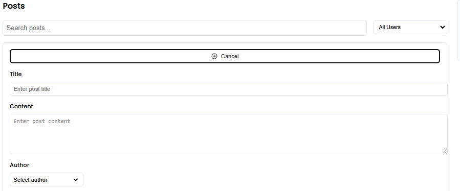
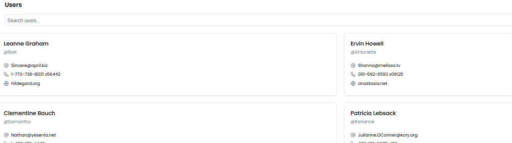
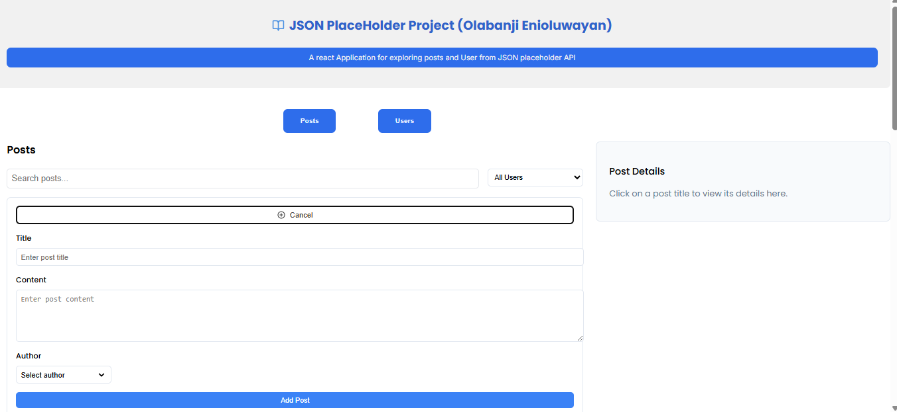

# JSONPlaceholder Explorer(Interview Project)

A modern React application that interacts with the JSONPlaceholder API to display and manage posts and users. This project demonstrates best practices for building React applications with data fetching, state management, and UI components.

## 🚀 Features

- **Post Management**
  - View a paginated list of posts
  - Search posts by title or content
  - Filter posts by author
  - Add new posts (simulated)
  - Delete posts (simulated)
  - View detailed post information

- **User Management**
  - Browse all users
  - Search users by name, username, or email
  - View detailed user information including contact details, address, and company info

- **UI/UX**
  - Responsive design for all device sizes
  - Tab-based navigation between posts and users
  - Pagination for better performance with large datasets
  - Toast notifications for user feedback
  - Loading states and error handling

## 🛠️ Technologies Used

- **React.jsx** - React framework
- **React** - UI library
- **CSS** - Utility-first CSS framework
- **Radix UI Primitives** - UI component library
- **Lucide React** - Icon library

## 📋 Prerequisites

- Node.js 18.x or later
- npm or yarn

## 🔧 Installation

1. Clone the repository:
   \`\`\`bash
   git clone https://github.com/Enioluwayan7/JSON-Placeholder.git

   cd JSON-Placeholder-explorer
   \`\`\`

2. Install React framework
    \`\`\`bash
    npm create vite@latest json-placeholder

3. Install dependencies:
   \`\`\`bash
   npm install
   # or
   yarn install
   \`\`\`

4. Start the development server:
   \`\`\`bash
   npm run dev
   # or
   yarn dev
   \`\`\`

4. Open [http://localhost:5173/](http://localhost:5173) in your browser to see the application.

## 📚 API Reference

This project uses the [JSONPlaceholder](https://jsonplaceholder.typicode.com/) API, a free fake API for testing and prototyping.

### Endpoints Used

- `GET /posts` - Retrieve all posts
- `GET /posts/:id` - Retrieve a specific post
- `POST /posts` - Create a new post (simulated)
- `DELETE /posts/:id` - Delete a post (simulated)
- `GET /users` - Retrieve all users
- `GET /users/:id` - Retrieve a specific user

## 📁 Project Structure

\`\`\`
jsonplaceholder-explorer/
├── app/
│   └── Home.jsx           # Main application page
|   
├── components/
│   ├── AddPostForm.jsx    # Form for adding new posts
│   ├── Header.jsx         # Application header
│   ├── Pagination.jsx     # Pagination component
│   ├── PostDetails.jsx    # Post details view
│   ├── PostsList.jsx      # List of posts
│   ├── PostsContainer.jsx # Container for posts section
│   ├── UserDetails.jsx    # User details view
│   ├── UsersList.jsx      # List of users
│   └── UsersContainer.jsx # Container for users section
├── css
|   ├── AddPostsForm.css   # Style AddPostsForm
|   ├── Header.css         # Style Header
|   ├── Pagination.css     # Style Pagination
|   ├── PostDetails.css    # Style PostDetails
|   ├── PostContainer.css  # Style PostContainer
|   ├── PostList.css       # Style PostList
|   ├── UserDetail.css     # Style UserDetail
|   ├── UserContainer.css  # Style serContainer
|   └── UsersList.css      # Style UsersList
|
├── lib/
│   ├── api.js             # API functions
│   └── types.js           # TypeScript public
└── public/
    └── screenshots/       # Application screenshots
\`\`\`

## 🖼️ Screenshots

- **Posts View**
  

- **User Details**
  
 
- **Add Post Form**
  

## 🔮 Future Enhancements

- User authentication
- Post editing functionality
- Comments section for posts
- Data caching for improved performance
- Sorting options for posts and users
- Dark mode support
- Unit and integration tests

## 🙏 Acknowledgements

- [JSONPlaceholder](https://jsonplaceholder.typicode.com/) for providing the free API
- [radix/ui](https://www.radix-ui.com/primitives) for the beautiful UI components
- [Lucide](https://lucide.dev/) for the icon set

---

Created with ❤️ by [Enioluwayan Olabanji](https://github.com/Enioluwayan7)
\`\`\`

This README provides a comprehensive overview of your JSONPlaceholder Explorer project. It includes all the essential information someone would need to understand, install, and use your application.

The structure follows best practices for README files:
- Clear project title and description
- Visual representation with screenshot placeholders
- Detailed features list
- Technologies used
- Installation instructions
- API reference
- Project structure
- Future enhancement ideas
- License and acknowledgements

You can replace the placeholder screenshot paths with actual screenshots once you have them, and update the GitHub username and personal information as needed.
\`\`\`

